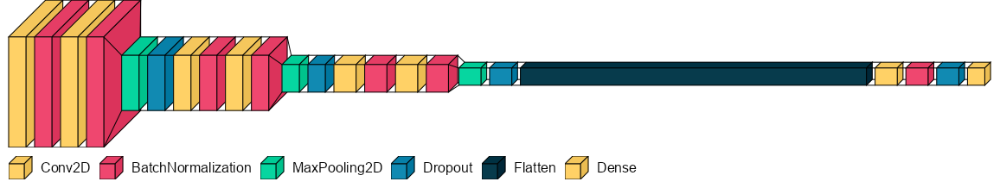
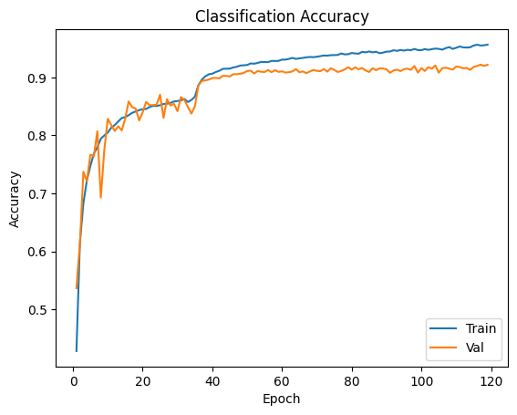
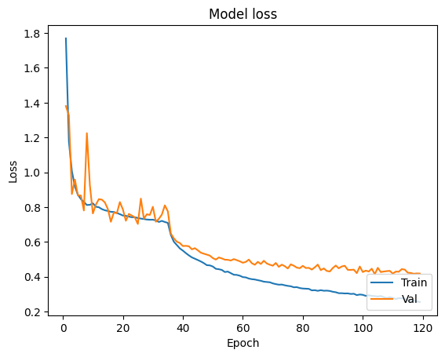
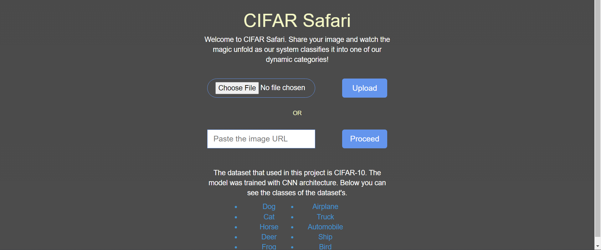
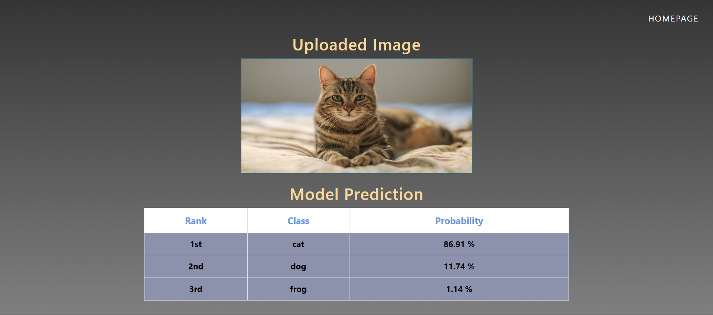
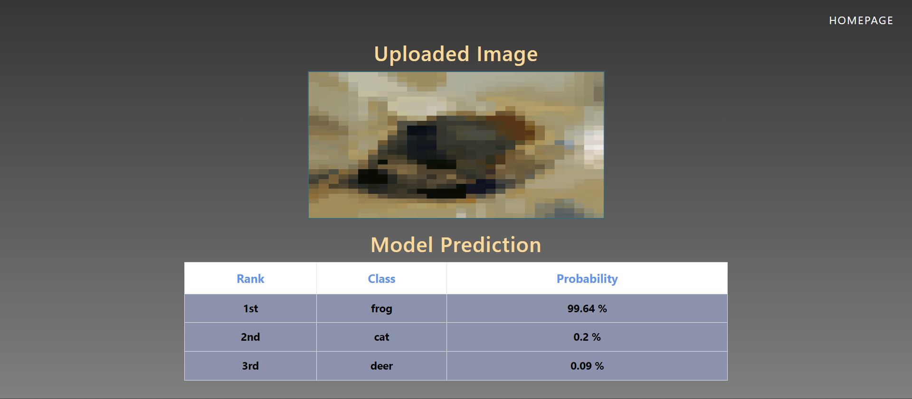

CIFAR-10 Model with GCP Deployment
===
<strong>Problem Statement Details: </strong>

<strong>Problem 3: </strong>
Machine Learning Engineering Challenge
Goal: Build a machine learning model and deploy it.

<strong>Task: </strong>
Develop a machine learning model (image classification) based on provided data and deploy it as a simple web application or API.

<strong>Output: </strong>
A GitHub repository with code, usage documentation and a live demo (could be a simple web page).

<strong>Evaluation: </Strong>
Performance of the model, code quality, and usability of the deployment.

Data: https://www.cs.toronto.edu/~kriz/cifar.html (use the CIFAR-10 version)

## Dependencies
```
pip install -r requirements.txt
```

## Directory Hierarchy
```
|—— .gcloudignore
|—— .gitignore
|—— Accuracy.png
|—— app.yaml
|—— CIFAR10_best.h5
|—— Classification Accuracy.png
|—— DataModel.ipynb
|—— Loss.png
|—— main.py
|—— requirements.txt
|—— Outputs
|    |—— Homepage.png
|    |—— Upload_via_Computer.png
|    |—— Upload_via_Link.png
|—— static
|    |—— css
|        |—— front.jpg
|        |—— grid.css
|        |—— material-design-iconic-font.min.css
|        |—— normalize.css
|        |—— style.css
|        |—— styleSucc.css
|    |—— images
|        |—— bird.png
|        |—— car.jpg
|        |—— deer.jpg
|        |—— dog.jpg
|        |—— frog.png
|        |—— horse.jpg
|        |—— img1.jpeg
|        |—— img2.jpg
|        |—— img3.jpg
|        |—— ship.png
|        |—— truck.jpg
|—— templates
|    |—— index.html
|    |—— success.html
|—— test_images
|    |—— bird.png
|    |—— car.jpg
|    |—— cat.jpg
|    |—— deer.jpg
|    |—— dog.jpg
|    |—— frog.png
|    |—— horse.jpg
|    |—— plane.jpeg
|    |—— ship.png
|    |—— truck.jpg
|—— __pycache__
|    |—— app.cpython-39.pyc
```

### Model Details
I have used the following architecture for the CNN model:
</img>

<strong>Hyperparameters:</strong>
<ol>
<li>
<b>Optimizer:</b> Adam
<ul>
Learning Rate = 0.001
</ul>
<ul>
beta_1 = 0.9
</ul>
<ul>
beta_2 = 0.999
</ul>
</li>
<li>
<b>Callbacks:</b>
<ul>
ReduceLROnPlateau
</ul>
<ul>
EarlyStopping
</ul>
</li>
<li>
<b>Epochs</b> = 200
</li>
</ol>

<strong>Results: </strong>
<br>
</img>
<br>
</img>

### Frontend Details
Home Page: <br>
Source: ```templates/index.html``` <br>
The name of the app is CIFAR Safari. It is a modest webpage with 2 options in it:
<ol>
<li>
Upload image from computer.
</li>
<li>
Upload image from internet link.
</li>
</ol>

The footer of the webpage contains the 10 possible classes that an image can be classified into, by the classifier. <br>

Upon, uploading the image by either methods, the image, is then fed into the ```CIFAR10_best.h5``` file as input for classification.

Success Page: <br>
Source: ```templates/success.html``` <br>
Upon successful classification, the user is re-directed to the next page, where the top 3 classes predicted by the model are displayed.

## Deployment Details
This app has been tested to work with Google Cloud Platform (GCP).<br>
<strong>Note: To prevent unwanted GCP billings, I had to disable the deployed application. </strong>
<br>The deployed app can be re-created using the following steps:

Clone the repo:
```
git clone https://github.com/AmayX/PS3.git
```
Move into PS3 folder.
```
cd PS3
```

Install <a href='https://cloud.google.com/sdk/docs/install'>Google Cloud SDK</a> and then in the root directory run the following command:
```
gcloud init
```

Sign in to your Google Cloud account then select the project, you want the app to be deployed into, then configure the project, and the availibility zones.
(This app was tested to work on ```us-east1``` availibility zone)

Then run the following command:
```
gcloud app deploy app.yaml --project <project-name>
```

Press 'y' when prompted then wait for 5-10 minutes for the deployment to complete.

Run the following command to view the deployed page:
```
gcloud app browse
```

A link with the following template will be opened in your web-browser:
https://{project-name}.{az}.r.appspot.com/

Now, check the functioning of the app.

### Local Testing using Flask
Clone the repo:
```
git clone https://github.com/AmayX/PS3.git
```

Move into PS3 folder.
```
cd PS3
```

Run the following command:
```
pip install -r requirements.txt 
```

Now, run the following command:
```
python main.py
```

The locally deployed app will start running on http://127.0.0.1:5000/

### Outputs
Expected outputs can be found in /outputs folder.
<b>Homepage:</b>
</img>
<b>Testing:</b>
</img>
</img>

### Tested Platform
- Software
  ```
  OS: Ubuntu LTS
  Python: 3.12.1 (anaconda)
  ```
- Hardware
  ```
  CPU: Intel Core i7 10750H
  GPU: Nvidia GTX1650 (4GB)
  ```
